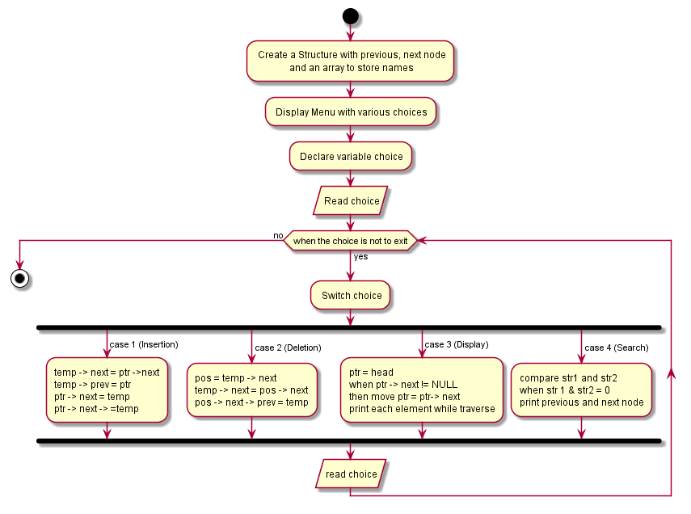

# Double-Linked-List
- Objective:

To create an interactive Menu using double linked list.

The repository consists of following Directories:

- Assets:

    Assets are flowchart files. We created our flowchart for the task using Plantuml and stored it here.

- Docs:

    It contains various issues we faced while developing Source for the given task. It is useful for future purpose while debugging an same kind of issue.

- src:

    It contains our task's source. We can pull this source and work with it on any required time

The following is the Flowchart for the task:

- Version:

	Double Linked List Version_v1.0.0